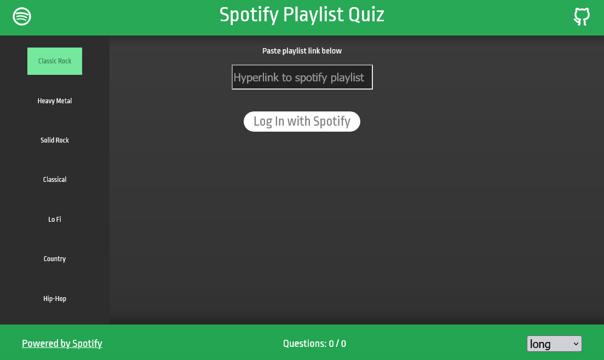

# Spotify-Quiz
A react-powered webapp for creating quizzes by using Spotify's API.

## About
This web application provides an interface to use the Spotify API as a bank for quiz material related to tracks, albums, and artists.

## Usage
1. Clone this repository
2. Create or find an auth token for Spotify's API. Spotify provides a description for creating a token [here](https://developer.spotify.com/documentation/general/guides/authorization/client-credentials/).
3. Create a .env file at the root directory.
4. Add "REACT_APP_SPOTIFY_AUTH_TOKEN=" to the .env file and supply it with your auth token.
5. Run `npm install` to install all required dependencies.
6. Run `npm start` to start the server.

